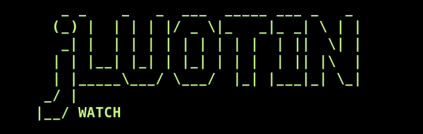

<p align="center">
  
</p>

# jWATCH

[](LICENSE)
[](https://www.python.org/downloads/)
[](https://developer.nvidia.com/embedded/jetson)
[](https://jetson-ai-lab.io)

jWATCH is a command-line benchmarking tool for NVIDIA Jetson.

It runs LLM inference through Ollama and samples hardware metrics in parallel, so you can inspect throughput/latency together with thermal and power behavior.

## What it does

- Benchmarks single models (`bench`)
- Compares multiple models (`compare`)
- Streams live hardware metrics (`monitor`)
- Saves benchmark history to SQLite (`history`)
- Compares two historical runs (`diff`)
- Exports runs to JSON (`export`)
- Supports `--mock` mode for development on non-Jetson machines

## Why this exists

On edge devices, raw tokens/sec can be misleading.
A model can look slower simply because the board is hotter, power-limited, or memory-constrained.
jWATCH captures inference and hardware state together so comparisons are easier to trust.

## Installation

```bash
python3 -m pip install -U pip
python3 -m pip install .
```

For development:

```bash
python3 -m pip install pytest pytest-asyncio pytest-cov black mypy
```

## Quick start

### 1. Validate environment

```bash
python3 -m edgewatch check
```

### 2. Run a quick mock benchmark (works on Mac/Linux)

```bash
python3 -m edgewatch bench \
  --model qwen3.5:0.8b \
  --prompt "Hello" \
  --runs 2 \
  --mock
```

### 3. Compare two models

```bash
python3 -m edgewatch compare \
  --model qwen3.5:0.8b \
  --model qwen:4b \
  --prompt "Write a short summary" \
  --runs 3 \
  --mock
```

### 4. Query stored runs

```bash
python3 -m edgewatch history --last 10
python3 -m edgewatch diff <run_id_a> <run_id_b>
python3 -m edgewatch export --output report.json --last 10
```

## Running on Jetson vs non-Jetson

- **Jetson**: run without `--mock` to use real `tegrastats` sampling
- **Mac/Linux (non-Jetson)**: use `--mock` for telemetry
- **Ollama**: optional in mock mode, required for real inference runs

## CLI commands

```text
bench    Benchmark a single model
compare  Compare multiple models
monitor  Monitor hardware metrics
check    Check Ollama + tegrastats availability
history  Show saved benchmark runs
diff     Compare two run IDs
export   Export runs to JSON
```

## Project layout

```text
edgewatch/
  analysis/
  correlation/
  ollama/
  report/
  storage/
  tegrastats/
  utils/
  edgewatch/cli.py
tests/
assets/
```

## Roadmap

- Better throttle event classification and reporting
- Stronger statistical summaries for long benchmark sessions
- Packaging cleanup for straightforward `pip install -e .`

## Contributing

Issues and PRs are welcome. If you plan to add a feature, open an issue first so we can align on scope.

## License

MIT — see [LICENSE](LICENSE).
